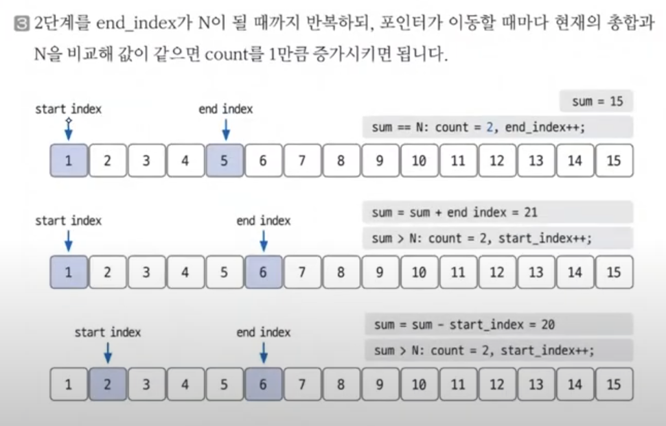

# 투 포인터 실전문제1

문제:  [수들의 합 5](https://www.acmicpc.net/problem/2018)

### 문제 분석하기

`문제 제시`

어떠한 자연수 N은, 몇 개의 연속된 자연수의 합으로 나타낼 수 있다. 당신은 어떤 자연수 N(1 ≤ N ≤ 10,000,000)에 대해서, 이 N을 몇 개의 연속된 자연수의 합으로 나타내는 가지수를 알고 싶어한다. 이때, 사용하는 자연수는 N이하여야 한다.

예를 들어, 15를 나타내는 방법은 15, 7+8, 4+5+6, 1+2+3+4+5의 4가지가 있다. 반면에 10을 나타내는 방법은 10, 1+2+3+4의 2가지가 있다.

N을 입력받아 가지수를 출력하는 프로그램을 작성하시오.

`문제 분석`

N의 범위가 1부터 10,000,000이기 때문에 제한 시간 1초 기준으로 O(NlogN)도 위험하기 때문에, O(N)의 시간 복잡도로 해결해야하는 상황이다.

해당 문제에서는 투 포인터를 사용할 수 있다.

여기서 투 포인터를 사용할 수 있는 이유는 **연속된 자연수의 합**이라는 부분이다. 투 포인터는 결국 **배열의 연속 범위**를 통해 작동하는 알고리즘이기 때문에 가능하다.

<br>

### 손으로 풀어보기

입력받은 값을 N에 저장 후 코드에서 사용할 변수를 모두 초기화 해준다 .
count는 자기 자신만을 포함했을 때 

```java
int sum = 1;
int count = 1;
```


- start_index
  
  - start_index가 오른쪽으로 한 칸 이동한다는 것의 의미는 연속된 배열에서 해당 인덱스의 값을 sum에서 빼준다는 의미이다.

- end_index
  
  - end_index가 오른쪽으로 한 칸 이동한다는 것의 의미는 연속된 배열에서 해당 인덱스의 값을 sum에서 더해준다는 의미이다.

`투 포인터 이동 원칙`

- sum > N: sum = sum  - start_index; startIndex++;

- sum < N: endIndex++; sum = sum  + endIndex;

- sum == N: endIndex++; sum = sum + endIndex; count++;

<br>

여기서 sum > N일 때와 sum <=N일 떄 포인터증가와 sum의 순서가 다른 이유

- endIndex는 새로운 인덱스의 값을 추가 시키는 역할이기 때문에, 추가시킬 인덱스의 값을 더해준 후에 sum에 추가하는 것이다.

- startIndex는 기존에 갖고 있는 인덱스의 값을 일종의 할당 해제해주는 것이기 때문에, 먼저 현재 인덱스의 값을 빼준 후에 다음 인덱스로 넘어간다. 



`슈도 코드`

```
N 변수 저장
사용 변수 초기화(count = 1, startIndex = 1, endIndex = 1, sum = 1)
while(endIndex < N) {
    if(sum == N) count증가 endIndex 증가 sum값 변경
    else if(sum > N) sum값 변경 startIndex 증가
    else if(sum < N) endIndex 증가 sum값 변경
}
count 출력하기
```

<br>

### 정답 코드

```java
    public static void main(String[] args) throws IOException {
        BufferedReader br = new BufferedReader(new InputStreamReader(System.in));
        int N = Integer.parseInt(br.readLine());

        int answer = 1; // 자기 자신 포함

        int currentSum = 1;
        int left = 1;
        int right = 1;
        while (right < N) {
            if (currentSum < N) {
                right++;
                currentSum += right;
            } else if (currentSum == N){
                answer++;
                currentSum -= left;
                left += 1;
            } else {
                currentSum -= left;
                left += 1;
            }
        }
        System.out.println(answer);
    }
```
