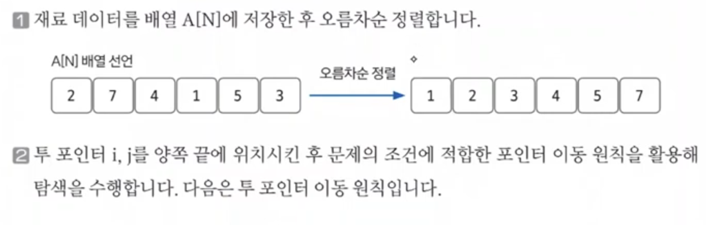
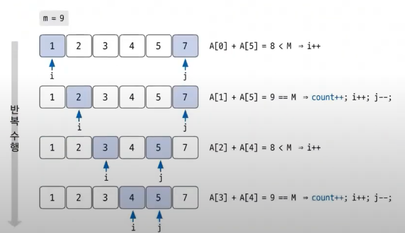

# 투 포인터 실전문제2

문제: [주몽](https://www.acmicpc.net/problem/1940)

### 문제 분석하기

`문제 제시`

주몽은 철기군을 양성하기 위한 프로젝트에 나섰다. 그래서 야철대장을 통해 철기군이 입을 갑옷을 만들게 하였다. 야철대장은 주몽의 명에 따르기 위하여 연구에 착수하던 중 아래와 같은 사실을 발견하게 되었다.

갑옷을 만드는 재료들은 각각 고유한 번호를 가지고 있다. 갑옷은 두 개의 재료로 만드는데 두 재료의 고유한 번호를 합쳐서 M(1 ≤ M ≤ 10,000,000)이 되면 갑옷이 만들어 지게 된다. 야철대장은 자신이 만들고 있는 재료를 가지고 갑옷을 몇 개나 만들 수 있는지 궁금해졌다. 이러한 궁금증을 풀어 주기 위하여 N(1 ≤ N ≤ 15,000) 개의 재료와 M이 주어졌을 때 몇 개의 갑옷을 만들 수 있는지를 구하는 프로그램을 작성하시오.

`문제 분석`

M의 범위가 1부터 10,000,000이다.

N의 범위는 약 1부터 15,000이다.

결국 N의 크기로 만들어지는 배열을 탐색하는 것이 핵심이고, O(N^2)이면 연산이 2억 이상이기 때문에 O(NlogN)안에 탐색을 완료해야한다.

정렬의 시간복잡도는 O(NlogN)이기 때문에 적당한 알고리즘이다. 

키 포인트는 재료들의 번호가 **고유 값**이라는 것이고, 갑옷을 만드는 것에 **두 개의 재료**만 필요하다는 점이다.

투포인터는 **값이 바뀌지 않는 연속된 배열**에서 사용 가능한 알고리즘이다.

### 손으로 풀어보기



`투 포인터 이동 원칙`

- A[i] + A[j] > M: j--;

- A[i] + A[j] < M: i++;

- A[i] + A[j] == M: i++; j--; count++;

i와 j가 만날 때까지 반복하고 반복이 끝날 때 count를 출력한다.



배열이 오름차순으로 먼저 정렬이 되어 있기 때문에 

- 타겟값인 M보다 작으면 왼쪽 인덱스를 증가시켜주면 값이 커진다.

- 타겟값이 M보다 크면 오른쪽 인덱스를 감소시켜주면 값이 작아진다.

- 타겟값과 M이 일치할 경우에는 주어진 배열 내부에 중복값이 없기 때문에, 왼쪽, 오른쪽 둘다 인덱스를 변경시켜준다.

`슈도 코드`

```
N(재료의 개수), M(갑옷이 되는 번호) 저장하기
for(N만큼 반복){
재료 배열 저장하기
}
재료 배열 정렬하기
while (i < j) {
if (재료 합 < M ) 작은 번호 재료를 한 칸 위로 변경하기
else if (재료 합 > M) 큰 번호 재료를 한 칸 아래로 변경하기
else count 증가, 양쪽 index 각각 변경하기
}
count 출력하기
```

### 정답 코드

```java
public static void main(String[] args) throws IOException {
    BufferedReader br = new BufferedReader(new InputStreamReader(System.in));
    int N = Integer.parseInt(br.readLine());
    int M = Integer.parseInt(br.readLine());
    StringTokenizer ingredients = new StringTokenizer(br.readLine());

    int[] ingredientArray = new int[N];
    for (int index = 0; index < N; index++) {
        ingredientArray[index] = Integer.parseInt(ingredients.nextToken());
    }

    Arrays.sort(ingredientArray);
    int answer = 0;
    int left = 0;
    int right = N-1;
    while(left < right) {
        int currentSum = ingredientArray[left] + ingredientArray[right];
        if (currentSum == M) {
            answer++;
            right--;
            left++;
        } else if (currentSum > M) {
            right--;
        } else {
            left++;
        }
    }
    System.out.println(answer);

}
```
