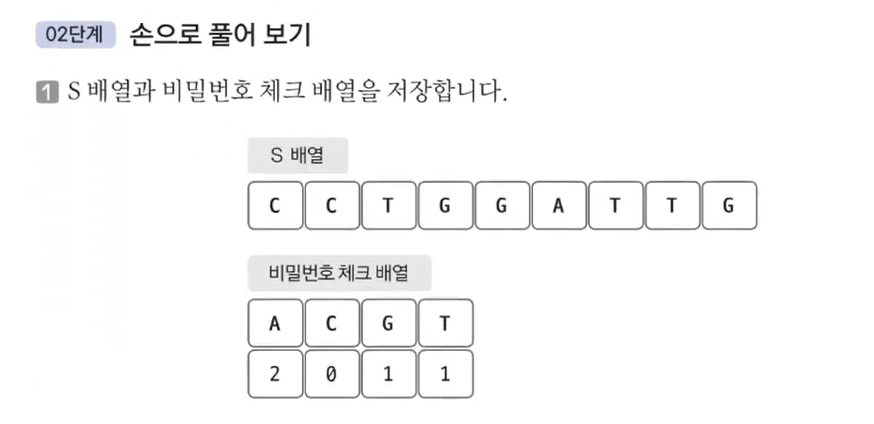
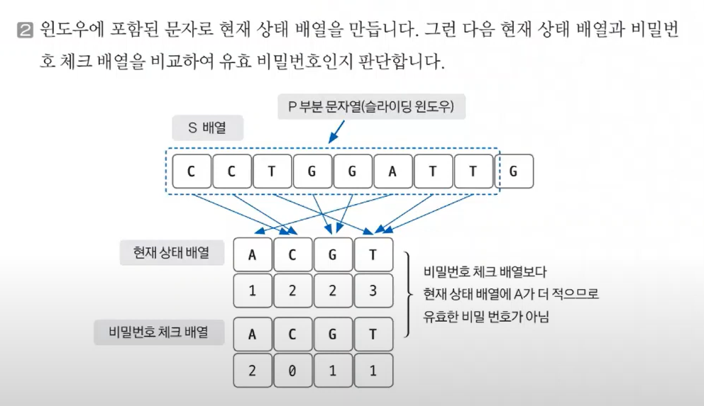
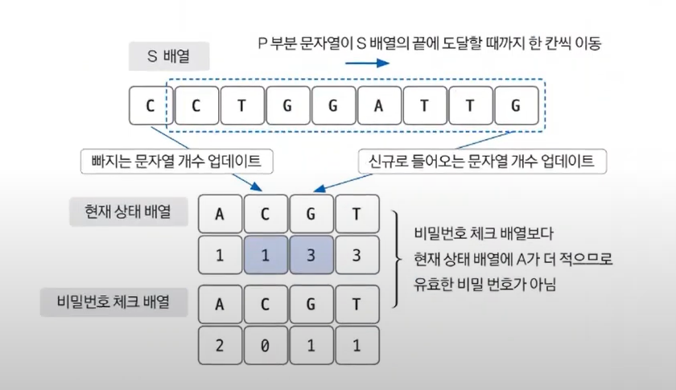

# 05. 슬라이딩 윈도우 실전문제

문제: [DNA 비밀번호](https://www.acmicpc.net/problem/12891)

<br>

`정의`

슬라이딩 윈도우 알고리즘은 2개의 포인터로 범위를 지정한 후에 **범위를 유지한 채** 이동하며 문제를 해결하는 방식

### 문제 분석하기

`문제 제시`

평소에 문자열을 가지고 노는 것을 좋아하는 민호는 DNA 문자열을 알게 되었다. DNA 문자열은 모든 문자열에 등장하는 문자가 {‘A’, ‘C’, ‘G’, ‘T’} 인 문자열을 말한다.

민호는 부분문자열에서 등장하는 문자의 개수가 특정 개수 이상이여야 비밀번호로 사용할 수 있다는 규칙을 만들었다.

임의의 DNA문자열이 “AAACCTGCCAA” 이고 민호가 뽑을 부분문자열의 길이를 4라고 하자. 그리고 부분문자열에 ‘A’ 는 1개 이상, ‘C’는 1개 이상, ‘G’는 1개 이상, ‘T’는 0개 이상이 등장해야 비밀번호로 사용할 수 있다고 하자. 이때 “ACCT” 는 ‘G’ 가 1 개 이상 등장해야 한다는 조건을 만족하지 못해 비밀번호로 사용하지 못한다. 하지만 “GCCA” 은 모든 조건을 만족하기 때문에 비밀번호로 사용할 수 있다.

민호가 만든 임의의 DNA 문자열과 비밀번호로 사용할 부분분자열의 길이, 그리고 {‘A’, ‘C’, ‘G’, ‘T’} 가 각각 몇번 이상 등장해야 비밀번호로 사용할 수 있는지 순서대로 주어졌을 때 민호가 만들 수 있는 비밀번호의 종류의 수를 구하는 프로그램을 작성하자. 단 부분문자열이 등장하는 위치가 다르다면 부분문자열이 같다고 하더라도 다른 문자열로 취급한다.

<br>

첫 번째 줄에 민호가 임의로 만든 DNA 문자열 길이 |S|와 비밀번호로 사용할 부분문자열의 길이 |P| 가 주어진다. (1 ≤ |P| ≤ |S| ≤ 1,000,000)

두번 째 줄에는 민호가 임의로 만든 DNA 문자열이 주어진다.

세번 째 줄에는 부분문자열에 포함되어야 할 {‘A’, ‘C’, ‘G’, ‘T’} 의 최소 개수가 공백을 구분으로 주어진다. 각각의 수는 |S| 보다 작거나 같은 음이 아닌 정수이며 총 합은 |S| 보다 작거나 같음이 보장된다.

<br>

`문제 분석`

P와 S의 길이가 1,000,000이기 때문에 O(N)의 시간 복잡도 알고리즘으로 문제를 해결해야 한다. 전체 배열 중 부분적으로 연속된 배열을 체크하는 것을 통해 슬라이딩 윈도우 기법을 활용할 수 있음을 알 수 있다.

### 손으로 풀어보기



S배열과 비밀번호 체크 배열을 저장한다. 

추가로, 윈도우에 포함된 문자로 현재 상태 배열을 만든다. 



기존 부분 문자열 배열 중 체크 된 부분은 이미 검증을 했기 때문에, 빠지는 문자열과 추가되는 문자열만 체크하면 된다는 것이 슬라이딩 윈도우 기법의 핵심 원리이다.



<br>

`슈도 코드`

```
// 데이터 저장
S(문자열 크기) P(부분 문자열 크기)
A(문자열 데이터)
checkArr(비밀번호 체크 배열)
// 변수 선언
currentArr(현재 상태 배열)
checkSecret(몇 개의 문자와 관련된 개수를 충족했는지 판단하는 변수)
P 범위(0 ~ P-1)만큼 S 배열에 적용하고, 유효한 비밀번호 인지 판단한다.
for(i를 P에서 S까지 반복) {
    j 선언 (i - P)
}
```

### 정답 코드

```java
import java.io.BufferedReader;
import java.io.IOException;
import java.io.InputStreamReader;
import java.util.*;

public class Main {
    public static void main(String[] args) throws IOException {
        int answer = 0;
        BufferedReader br = new BufferedReader(new InputStreamReader(System.in));
        StringTokenizer st = new StringTokenizer(br.readLine());
        int S = Integer.parseInt(st.nextToken());
        int P = Integer.parseInt(st.nextToken());
        char[] dnaString = br.readLine().toCharArray();
        int[] checkArray = new int[4];
        st = new StringTokenizer(br.readLine());

        for (int index = 0; index < 4; index++) {
            checkArray[index] = Integer.parseInt(st.nextToken());
        }

        // Map을 통해 index와 character 연결
        Map<Character, Integer> indexMap = new HashMap<>();
        indexMap.put('A', 0);
        indexMap.put('C', 1);
        indexMap.put('G', 2);
        indexMap.put('T', 3);

        int[] currentArray = new int[4];
        Deque<Character> dq = new ArrayDeque<>(P);

        // 초기 슬라이딩 윈도우 설정
        for (int index = 0; index < P; index++) {
            char currentCharacter = dnaString[index];
            dq.addLast(currentCharacter);
            currentArray[indexMap.get(currentCharacter)] += 1;
        }

        if (check(checkArray, currentArray)) {
            answer++;
        }
        for (int index = P; index < S; index++) {
            // Deque에서 빼주고, 해당 부분을 currentArray에서 count제거
            char outCharacter = dq.pollFirst();
            currentArray[indexMap.get(outCharacter)] -= 1;
            char inCharacter = dnaString[index];
            dq.addLast(inCharacter);
            currentArray[indexMap.get(inCharacter)] += 1;
            if (check(checkArray, currentArray)) {
                answer++;
            }
        }
        System.out.println(answer);

    }
    public static boolean check(int[] checkArray, int[] currentArray) {
        for (int index = 0; index < 4; index++) {
            if (checkArray[index] > currentArray[index]) {
                return false;
            }
        }
        return true;
    }
}
```
