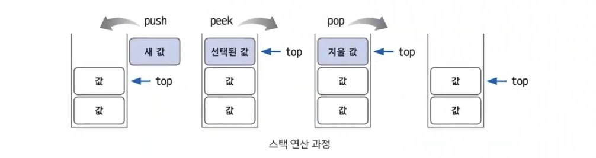

# 06. 스택과 큐

### 스택

`정의`

스택은 삽입과 삭제 연산이 후입선출(Last In First Out)로 이루어지는 자료구조

후입 선출은 삽입과 삭제가 한 쪽에서만 일어남

 

`스택 용어`

- top: 삽입과 삭제가 일어나는 위치를 뜻한다.

 

`연산`

- push: top 위치에 새로운 데이터를 삽입

- pop: top 위치에 있는 데이터를 삭제 및 확인

- peek: top 위치에 있는 데이터를 확인

 

`활용처`

깊이 우선 탐색(DFS), 백트래킹 종류의 코딩 테스트에 효과적

재귀와 원리가 유사하기 때문

 

### 큐

`정의`

삽입과 삭제의 연산이 선입선출로 발생하는 자료구조

새 값의 추가는 큐의 rear 부분에서 발생하고, 삭제는 큐의 front 부분에서 발생

 

`큐 용어`

- rear: 큐에서 가장 끝 데이터

- front: 큐에서 가장 앞의 데이터

- add: rear 부분에서 데이터를 삽입

- poll: front 부분에 있는 데이터를 삭제하고 확인

- peek: front에 있는 데이터를 확인

 

`활용처`

넓이 우선 탐색 등
