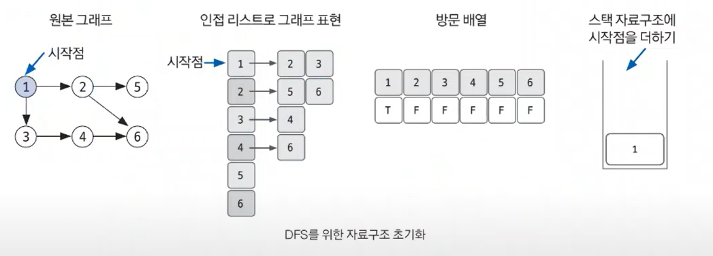
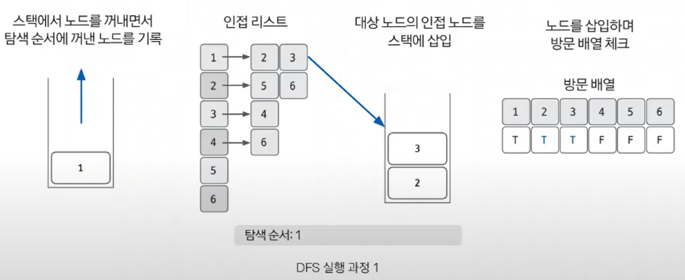

# 01. DFS (깊이 우선 탐색)

`정의`

그래프 완전 탐색 기법 중 하나, 그래프의 시작 노드에서 출발하여 탐색할 한 쪽 분기를 정하여, 최대 깊이까지 탐색을 마친 후 다른 쪽 분기로 이동하여 다시 탐색을 수행하는 알고리즘

 

깊이 우선 탐색

| 기능        | 특징                   | 시간복잡도(노드 수:V, 엣지 수: E) |
| --------- | -------------------- | ---------------------- |
| 그래프 완전 탐색 | 재귀 함수 스택 자료구조 이용 | O(V+E)                 |

 

### 핵심 이론

DFS는 한 번 방문한 노드를 다시 방문하면 안되기 때문에, 노드 방문 여부를 체크할 배열이 필요하다.

1. **`DFS를 시작할 노드를 정한 후 사용할 자료구조 초기화`**

스택에서 시작 노드를 1로 삽입할 때 해당 위치의 방문 배열을 체크하면 T, F, F, F, F, F가 된다.

 

2. **`스택에서 노드를 꺼낸 후 꺼낸 노드의 인접 노드를 다시 스택에 삽입한다`**

pop을 수행하여 노드를 꺼낸다. 꺼낸 노드를 탐색 순서에 기입하고, 인접 리스트의 인접 노드를 스택에 삽입하여 방문 배열을 체크한다. 방문 배열은 T, T, T, F, F, F가 된다.

 

3. **`스택 자료구조에 값이 없을 때까지 반복한다`**

스택이 값이 없다는 뜻은 방문 할 수 있는 노드를 모두 방문했음을 뜻한다. 핵심은 이미 다녀간 노드는 방문 배열을 바탕으로 스택에 재삽입하지 않는 것이 핵심이다.

 
