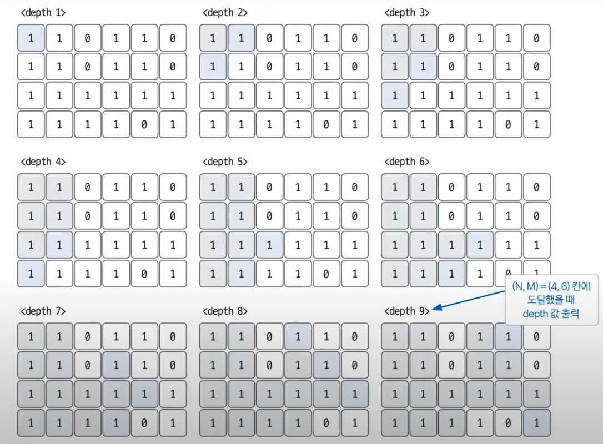

# 04. BFS 실전문제

문제:  [미로탐색하기](https://www.acmicpc.net/problem/2178)

<br>

### 문제 분석하기

`문제 제시`

N×M크기의 배열로 표현되는 미로가 있다.

| 1   | 0   | 1   | 1   | 1   | 1   |
| --- | --- | --- | --- | --- | --- |
| 1   | 0   | 1   | 0   | 1   | 0   |
| 1   | 0   | 1   | 0   | 1   | 1   |
| 1   | 1   | 1   | 0   | 1   | 1   |

미로에서 1은 이동할 수 있는 칸을 나타내고, 0은 이동할 수 없는 칸을 나타낸다. 이러한 미로가 주어졌을 때, (1, 1)에서 출발하여 (N, M)의 위치로 이동할 때 지나야 하는 최소의 칸 수를 구하는 프로그램을 작성하시오. 한 칸에서 다른 칸으로 이동할 때, 서로 인접한 칸으로만 이동할 수 있다.

위의 예에서는 15칸을 지나야 (N, M)의 위치로 이동할 수 있다. 칸을 셀 때에는 시작 위치와 도착 위치도 포함한다.

<br>

입력

첫째 줄에 두 정수 N, M(2 ≤ N, M ≤ 100)이 주어진다. 다음 N개의 줄에는 M개의 정수로 미로가 주어진다. 각각의 수들은 **붙어서** 입력으로 주어진다.

<br>

출력

첫째 줄에 지나야 하는 최소의 칸 수를 출력한다. 항상 도착위치로 이동할 수 있는 경우만 입력으로 주어진다.

<br>

`문제 분석`

N과 M의 크기가 작기 때문에 DFS와 BFS를 구분하지 않아도 된다.

하지만, 해당 문제에서 BFS가 적합한 이유는 지나가야하는 수의 **최솟값**을 찾는 것이기 때문

이는 완전 탐색을 이용하여 몇 번째 깊이에서 원하는 값을 찾을 수 있는 지에 대한 최솟값을 찾는 문제다.

### 손으로 풀어보기

BFS의 depth별 탐색 범위



우리가 원하는 값은 오른쪽 하단에 몇번 째 depth만에 가는지이지만, 해당 방식으로 원하는 모든 좌표의 최단 거리를 탐색할 수 있다.

<br>

`슈도 코드`

```java
dx, dy(상하좌우를 탐색하기 위한 define값 정의 변수)
graph(데이터 저장 2차원 행렬)
N(row), M(column)
visited(방문 기록 저장 배열)
graph 초기화

for (N의 개수만큼 반복) {
    for(M의 개수만큼 반복) {
        graph 배열에 데이터 저장
    }
}
BFS(1, 1) 실행

BFS {
    큐 자료구조에 시작 노드 삽입 (1, 1)
    visited 배열에 현재 노드 방문 기록
    while (큐가 빌 때까지) {
        큐에서 노드 데이터 가져오기 poll()
        for (상하좌우 탐색) {
            if (이동할 좌표 유효성 검사) {
                if (우리가 찾는 좌표인지 확인) {
                    return;
                }
                visited 배열에 방문 기록
                큐에 이동한 좌표 및 depth+1 데이터 삽입
            }
        }
    }
}
```

### 정답 코드

```java
import java.io.BufferedReader;
import java.io.IOException;
import java.io.InputStreamReader;
import java.util.*;

public class Main {
    static int[] dr = {-1, 1, 0, 0};
    static int[] dc = {0, 0, -1, 1};
    public static void main(String[] args) throws IOException {
        BufferedReader br = new BufferedReader(new InputStreamReader(System.in));
        StringTokenizer st = new StringTokenizer(br.readLine());
        int N = Integer.parseInt(st.nextToken());
        int M = Integer.parseInt(st.nextToken());
        int[][] graph = new int[N+1][M+1];
        boolean[][] visited = new boolean[N+1][M+1];
        for (int row = 1; row < N+1; row++) {
            String inputString = br.readLine();
            for (int column = 1; column < M+1; column++) {
                graph[row][column] = Integer.parseInt(inputString.substring(column-1, column));
            }
        }

        Queue<int[]> q = new ArrayDeque<>();
        q.add(new int[]{1, 1, 1});
        visited[1][1] = true;
        while (!q.isEmpty()) {
            int[] current = q.poll();
            for (int index = 0; index < 4; index++) {
                int nr = current[0] + dr[index];
                int nc = current[1] + dc[index];
                if (nr <= 0 || nr > N || nc <= 0 || nc > M || visited[nr][nc] || graph[nr][nc] == 0) {
                    continue;
                }
                if (nr == N && nc == M) {
                    System.out.println(current[2]+1);
                    return;
                }
                q.add(new int[]{nr, nc, current[2]+1});
                visited[nr][nc] = true;
            }
        }
    }
}
```
