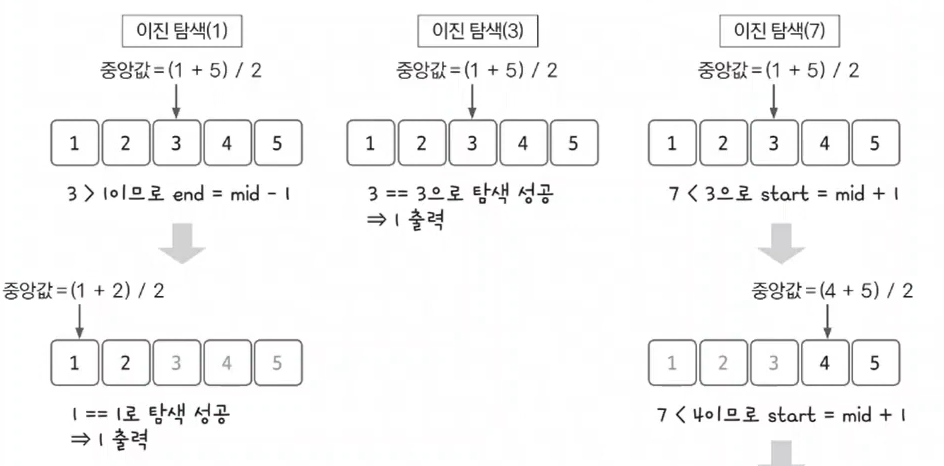

# 06. 이진 탐색 실전문제

문제: [수 찾기](https://www.acmicpc.net/problem/1920)

### 문제 분석하기

`문제 제시`

N개의 정수 A[1], A[2], …, A[N]이 주어져 있을 때, 이 안에 X라는 정수가 존재하는지 알아내는 프로그램을 작성하시오.

<br>

첫째 줄에 자연수 N(1 ≤ N ≤ 100,000)이 주어진다. 다음 줄에는 N개의 정수 A[1], A[2], …, A[N]이 주어진다. 다음 줄에는 M(1 ≤ M ≤ 100,000)이 주어진다. 다음 줄에는 M개의 수들이 주어지는데, 이 수들이 A안에 존재하는지 알아내면 된다. 모든 정수의 범위는 -231 보다 크거나 같고 231보다 작다.

<br>

M개의 줄에 답을 출력한다. 존재하면 1을, 존재하지 않으면 0을 출력한다.

<br>

`문제 분석`

N의 범위가 100,000이기 때문에 단순 반복문으로는 문제를 풀 수 없다.

O(NlogN) 시간 복잡도로 해결하기 위해 이진 탐색을 적용해봐야한다.

### 손으로 풀어보기

1. 탐색 데이터를 1차원 배열에 저장한 후, 저장된 배열을 정렬한다.

ex) 4, 1, 5, 2, 3 -> 1, 2, 3, 4, 5

2. Target이 배열에 존재하는지 이진 탐색을 통해 확인한다.
   
   1. target을 1로 가정한다.
   
   2. 중앙값 = (1 + 5) / 2 -> 중앙값이 3이기 때문에 target보다 커서 오른쪽을 버린다.
   
   3. 여기서 중요한 것은 한 쪽을 버릴 때 중앙값도 이미 체크했기 때문에 중앙값도 같이 후보에서 날려도 된다.
   
   4. end = mid - 1
   
   5. 반대의 경우에도 start = mid +1을 해줄 수 있다. 



`슈도 코드`

```
N(정렬할 수 개수) M(탐색할 숫자의 개수)
arr(정렬할 배열 선언)
for (N의 개수만큼 반복){
    arr 배열 값 저장
}
A 배열 정렬

for (M의 개수만큼 반복) {
    target(찾아야하는 수)
    left(시작 인덱스)
    right(종료 인덱스)
    while(시작 인덱스 <= 종료 인덱스) {
        mid(중간 인덱스)
        if (중앙값 > target) {
            right = right -1
        }
        else if (중앙값 < target) {
            left = left +1 
        }
        else {
            찾았기 때문에 반복문 종료
        }
    }
    if(찾았다면) 1 출력
    else 0 출력
}
```

### 정답 코드

```java
import java.io.BufferedReader;
import java.io.IOException;
import java.io.InputStreamReader;
import java.util.*;

public class Main {
    static int[] dr = {-1, 1, 0, 0};
    static int[] dc = {0, 0, -1, 1};
    public static void main(String[] args) throws IOException {
        BufferedReader br = new BufferedReader(new InputStreamReader(System.in));
        int N = Integer.parseInt(br.readLine());
        StringTokenizer st = new StringTokenizer(br.readLine());
        int[] arr = new int[N];
        for (int index = 0; index < N; index++) {
            int num = Integer.parseInt(st.nextToken());
            arr[index] = num;
        }
        Arrays.sort(arr);

        int M = Integer.parseInt(br.readLine());
        st = new StringTokenizer(br.readLine());
        for (int index = 0; index < M; index++) {
            int target = Integer.parseInt(st.nextToken());
            boolean flag = false;
            int left = 0;
            int right = N-1;
            while (left <= right) {
                int mid = (left + right) / 2;
                if (target == arr[mid]) {
                    flag = true;
                    break;
                } else if (target > arr[mid]) {
                    left = mid + 1;
                } else {
                    right = mid - 1;
                }
            }
            if (flag) {
                System.out.println(1);
            } else {
                System.out.println(0);
            }

        }
    }
}

```
