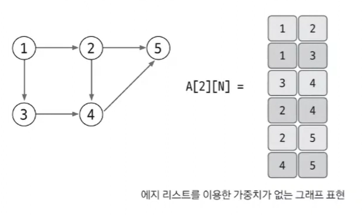
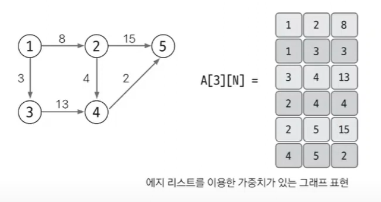
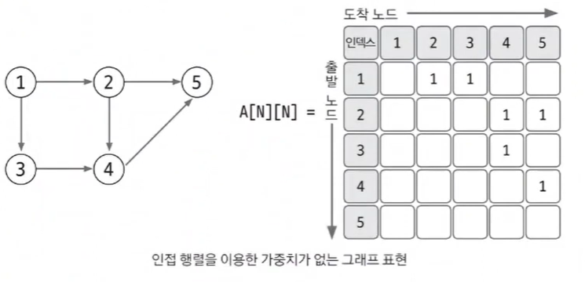
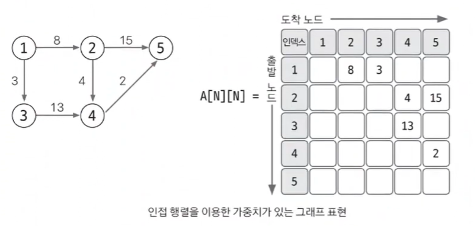
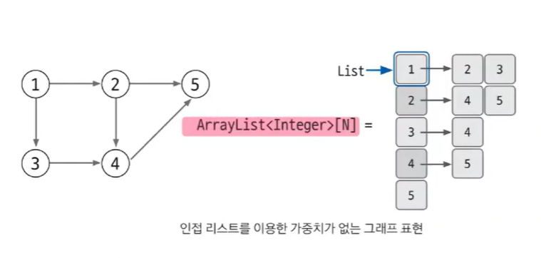
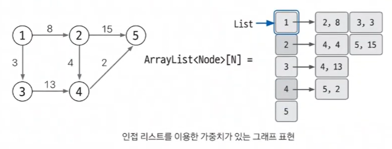

# 02. 그래프의 표현

`그래프의 표현 방법 3가지`

 

### 1. 엣지 리스트

엣지를 중심으로 그래프를 표현

`엣지 리스트로 가중치 없는 그래프 표현하기`

해당 엣지 리스트는 start, end를 통해 2차원 배열로 엣지 리스트를 표현함.

위 예시는 방향이 있는 그래프고, 방향이 없을 때는 갈 수 있는 저장할 때 두 가지를 넣는 것이 맞다.

 

`엣지 리스트로 가중치 있는 그래프 표현하기`

start, end, 가중치로 표현된다.

하지만 해당 방식은 특정 노드와 관련되어 있는 엣지를 탐색하기에는 부적절하다.

엣지 리스트는 벨만 포트나 크루스칼(MST) 알고리즘에 사용하며, 노드 중심 알고리즘에는 잘 사용되지 않는다.

 

### 인접 행렬

`인접 행렬로 가중치 없는 그래프 표현하기`

인접행렬은 1에서 2로 향할 때 1행 2열에 1을 저장하는 방식으로 표현한다.

 

`인접 행렬로 가중치 있는 그래프 표현하기`

만약 가중치가 있을 경우에는 1대신 가중치를 집어넣는다.

 

`인접 행렬 방식의 단점`

인접 행렬 방식의 단점은 특정 노드에서 엣지를 탐색하려면 무조건 N번 접근해야하기 떄문에 노드 개수에 비해 엣지가 적을 떄에는 비효율적이다. ex) 4번에서 접근이 가능한 노드는 5번밖에 없는데 4번에서 접근 가능한 엣지를 찾으려면 N번 전부 탐색해야하기 떄문

 

### 인접 리스트

노드 개수만큼 ArrayList를 선언한다.

일반적으로 알고리즘에서는 노드 중심의 알고리즘이 많아 가장 많이 사용하는 자료구조

`인접 리스트로 가중치 없는 그래프 표현하기`

가중치가 없을 때 기준: ArrayList<Integer>[N]으로 선언한다

배열은 모든 노드들을 가리키며 ArrayList안에 담기는 것은 단지 해당 배열의 인덱스에 연결된 노드의 고유 번호를 가리킨다. 그래서 공간 복잡도와 시간 복잡도의 효율이 인접배열보다 좋다

 

`인접 리스트로 가중치 있는 그래프 표현하기`

가중치가 있을 경우 자료구조가 바뀐다. (도착 지점, 가중치)를 갖는 Node클래스를 선언하여 ArrayList에 추가한다.

ArrayList<Node>[N]

방식은 조금 복잡하다고 느껴질지 몰라도, 노드간의 연결되어 있는 엣지탐색하기에 탁월하며, 노드 개수가 커도 메모리 초과가 발생할 확률이 적어진다.

