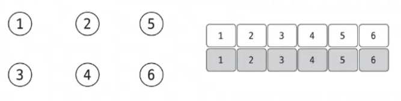

# 04. 유니온 파인드(Union-Find)

### 정의

여러 노드가 있을 때, 특정 2개의 노드를 연결해 1개의 집합으로 묶는 union 연산과

두 노드가 같은 집합에 속해 있는지를 확인하는 find연산으로 구성되어있다.

 

`동작 원리`

유니온 파인드를 표현하는 방법은 1차원 배열을 이용하는 것이다.

처음에는 노드가 연결되어 있지 않기 때문에, 각 인덱스에 자기 자신을 집합의 대표 노드로 설정한다.

2개의 노드를 선택해 각각의 대표 노드를 찾아 연결하는 union 연산을 수행한다.

union(1, 4)를 수행한다고 생각한다면 1과 4를 같은 집합으로 묶는다는 뜻이다.

특정 기준을 잡으면 되는데, 노드 번호가 작은 노드를 대표 노드로 갖는다는 기준을 잡았을 때, 집합 {1, 4}의 대표 노드는 1이 된다.

 

**중요한 점은 union 과정에서 대표 노드끼리 연결해줘야 한다.**

여기서, 대표 노드를 찾는 과정이 find연산이다.

대표 노드를 찾는 방법은 특정 노드에서 해당 노드의 인덱스에 저장되어 있는 값을 보면 된다. find연산 중 인덱스와 저장되어 있는 값이 같을 때, 해당 노드가 대표 노드가 된다.

 

위 사진에서 1번 과정을 통해 {1,4}집합과 2번 과정을 통해 {5, 6} 집합을 만들었다. 3번 과정에서는 union(4, 6)을 하게 된다면, 두 집합을 합치는 과정을 갖게 된다.

union과정은 대표 노드끼리 진행해야 하기 때문에, find과정을 거쳐 각 집합의 대표노드를 찾고,  서로 연결시켜주는 과정을 통해 union을 구현한다.

해당 union-find 과정을 통해서 그래프를 정돈하고, 시간 복잡도를 향상시킨다.

 

`find 연산의 작동 원리`

1. 대상 노드의 배열에 index값과 value가 동일하는지 확인한다.

2. 동일하지 않다면, value값이 가리키는 index 위치로 이동한다.

3. 이동 위치와 index값이 같을 때까지 탐색을 반복한다.

4. value와 index값이 같으면 해당 index가 대표 노드다.

 

`동작 압축`

find연산은 재귀함수로 구현되는데, 재귀함수에서 나오면서 각각의 인덱스의 value를 대표노드 값으로 업데이트 해주는 과정을 거치는 것이 중요하다.

 

재귀 함수를 빠져나오는 과정에서 return되는 값을 각 노드의 대표 노드로 업데이트하는 과정을 거쳐준다면 대표 노드를 찾는 과정이 훨씬 빨라진다.

find과정을 한 번거치면서 대표 노드를 찾는 과정이 5번이 단 1번으로 단축된다.

