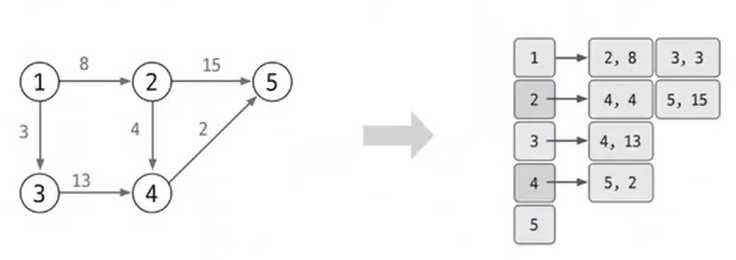

# 08. 다익스트라

### 정의

그래프에서 특정 노드에서의 다른 노드들의 최단 거리를 구하는 알고리즘

`특징`

| 기능                       | 특징        | 시간 복잡도(V:노드, E:엣지 |
| ------------------------ | --------- | ----------------- |
| 출발 노드와 모든 노드 간의 최단 거리 탐색 | 엣지는 모두 양수 | O(ElogV)          |

 

### 동작 원리

1. 인접 리스트로 그래프 구현

그래프의 연결 상태를 표현하기 위해서 인접 리스트에 연결한 배열의 자료형은 (노드, 가중치)와 같은 형태로 선언하여 연결한 점도 고려해야한다.

2. 최단 거리 배열 초기화

최단 거리 배열을 만들고, 출발 노드 = 0, 이외의 노드는 무한으로 초기화한다.

3. 값이 가장 작은 노드 고르기

4. 최단 거리 배열 업데이트하기

Min(선택 노드의 최단 거리 배열의 값 + 엣지 가중치, 연결 노드의 최단 거리 배열의 값)

5. 3번과 4번을 반복한다.

3번과 4번을 반복할 때, 방문 배열을 만들어서 방문한 노드는 넣지 않도록 주의한다.

 

최종 완성된 노드의 의미는 **시작 노드**에서 모든 노드까지의 최단 거리를 의미한다.

시작 노드라는 것이 가장 중요한 것이다.
