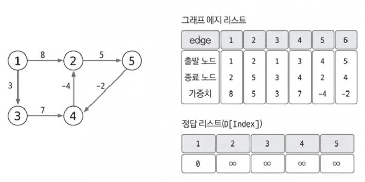

# 09. 벨만-포드

### 정의

그래프에서 특정 노드에서의 다른 노드들의 최단 거리를 구하는 알고리즘

`특징`

| 기능                              | 특징                                                              | 시간 복잡도(V:노드, E:엣지 |
| ------------------------------- | --------------------------------------------------------------- | ----------------- |
| 특정 출발 노드에서 다른 모든 노드까지의 최단 경로 탐색 | 음수 가중치 엣지가 있어도 수행할 수 있음 전체 그래프에서 **음수 사이클의 존재 여부를 판단**할 수 있음 | O(VE)             |

### 동작 원리

1. 엣지 리스트로 그래프를 구현하고 최단 경로 리스트 초기화

벨만-포드 알고리즘은 엣지를 중심으로 동작한다. 그래서, 그래프를 엣지 리스트로 구현한다.

또한, 최단 경로 리스트를 출발 노드는 0, 나머지 노드는 무한대로 초기화한다.

2. 모든 엣지를 확인해 정답 리스트 업데이트하기

최단 거리 리스트에서 업데이트 반복 회수는 노드 개수 -1이다. 음수 사이클이 없을 떄, 특정 두 노드의 최단 거리를 구성할 수 있는 엣지의 최대 개수는 N-1이기 떄문이다.

음수 사이클이 없을 때, N-1번의 엣지 사용횟수를 반복하게 되면, 출발 노드와 모든 노드 간 최단 거리를 알려주는 정답 리스트가 완성된다.

3. 음수 사이클 유무 확인하기

음수 사이클 유무를 확인하기 위해 모든 엣지를 한 번씩 다시 사용해 업데이트되는 노드가 발생하는지 확인한다. 만약 업데이트가 되는 노드가 있다면 음수 사이클이 있다는 뜻

