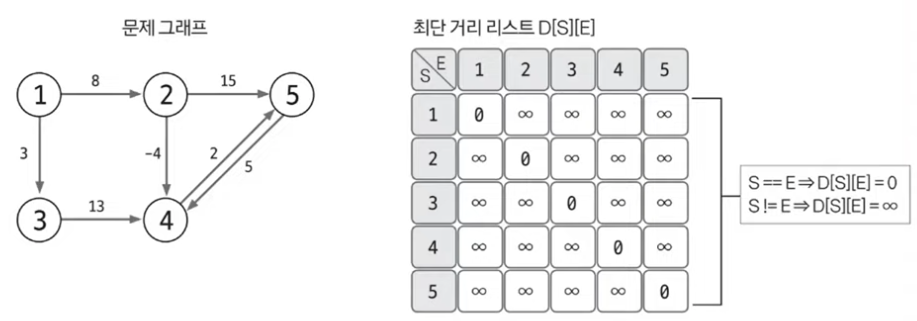
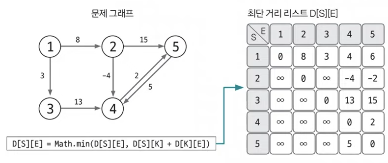

# 10. 플로이드-워셜

### 정의

그래프에서 모든 노드 간 최단 거리를 구하는 알고리즘

| 기능               | 특징                                               | 시간복잡도(V: 노드 수) |
| ---------------- | ------------------------------------------------ | -------------- |
| 모든 노드 간 최단 경로 탐색 | 음수 가중치 엣지가 있어도 수행 가능<br>동적 계획법의 원리를 이용해 알고리즘에 접근 | O(V^3)         |

시간복잡도 상으로 봤을 떄, 알고리즘 문제에서 노드 개수가 1000개 이상씩 안나오고 200, 100개 정도로 나온다.

### 핵심 원리

A 노드에서 B노드까지 최단 경로를 구했다고 가정했을 때, 최단 경로 위 K노드가 존재한다면 그것을 이루는 부분 경로 역시 최단 경로라는 뜻

1-3-4-5 라는 경로가 1에서 5까지의 최단경로일 때, 1에서 4까지의 최단경로도 1-4일 것이다 라는 가정을 의미

`도출한 플로이드-워셜 점화식`

```
D[S][E] = Math.min(D[S][E], D[S][K] + D[K][E])
```

<br>

구현 방식

1. 리스트를 선언하고 초기화하기

D[S][E]는 노드 S에서 E까지의 최단 거리를 저장하는 리스트

자기 자신으로 가는 노드를 0으로 초기화 하고 나머지는 무한대로 초기화한다.



<br>

2. 최단 거리 리스트에 그래프 데이터 저장하기

출발 노드는 S, 도착 노드는 E, 해당 엣지의 가중치는 W로 정의할 떄, D[S][E] = W로 엣지의 정보를 리스트에 입력한다. 플로이드 워셜은 그래프를 인접행렬로 표시한다는 점을 확인해야 한다.

<br>

3. 점화식으로 리스트 업데이트하기

기존에 구현했던 점화식을 3중 for문의 형태로 반복하여 리스트의 값을 업데이트 한다.

3중 for문 중 **경유지(K)가 가장 먼저 나오는 for문**이라는 것을 명심합시다.

```
for 경유지 K에 대해 (1~ N) N: 노드 개수
    for 출발 노드 S에 관해 (1~N)
        for 도착 노드 E에 관해(1 ~ N)
            D[S][E] = Math.min(D[S][E], D[S][K] + D[K][E])
```



<br>

### 정리

1. 플로이드 워셜을 통해 완성된 리스트는 모든 노드 간의 최단 거리를 알려준다.

2. 출발 노드부터의 최단 거리가 아닌 모든 노드 간의 최단 거리이기 떄문에, 시간 복잡도 O(V^3)으로 빠르지 않다.

3. 시간 복잡도가 느리기 때문에, 일반적인 코딩테스트에서 노드의 개수가 커봐야 백단위일 경우 쓰인다.


