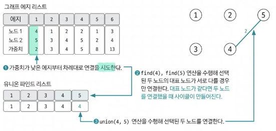

# 11. 최소 신장 트리(MST)

### 정의

그래프에서 모든 노드를 연결할 때, 사용된 엣지들의 가중치의 합을 최소로 하는 트리

`알고리즘`

- 크루스칼

- 프림

`특징`

- 사이클이 포함되면 가중치의 합이 최소가 될 수 없으므로 사이클을 포함하지 않는다.

- N개의 노드가 있으면 최소 신장 트리를 구하는 엣지의 개수는 항상 N-1이다.

### 핵심 이론

1. **엣지 리스트로 그래프를 구현하고 유니온 파인드 리스트 초기화 하기**

최소 신장 트리는 데이터를 노드가 아닌 엣지 중심으로 저장하기 때문에, 인접 리스트가 아닌 엣지리스트로 초기 데이터를 저장한다.

엣지 리스트 구성 요소는 노드1, 노드2, 가중치로 이루어진다.

그리고 유니온 파인드 리스트를 본인 노드의 인덱스로 초기화한다.

 

2. **그래프 데이터를 가중치 기준으로 정렬하기**

엣지 리스트에 담긴 그래프 데이터를 **가중치 기준으로 오름차순 정렬**한다.

3. **가중치가 낮은 엣지부터 연결 시도하기**

처음에 연결을 바로 시도하지 않고, find연산을 통해 사이클 유무를 확인한 후 사이클이 형성되지 않을 때만 union 연산을 이용해 두 노드를 연결한다.

연결하기 전에 대표노드가 같다면, 서로 연결함으로써 사이클이 생기기 때문에 안된다.

4. **3번 과정을 연결된 엣지가 N-1될 때까지 반복한다.**

5. **총 엣지 비용 출력하기**

 

최소 신장 트리는 다른 그래프 알고리즘과는 달리, 엣지 리스트의 형태를 이용해 데이터를 담는다

 

추천 문제: [최소 스패닝 트리](https://www.acmicpc.net/problem/1197)

