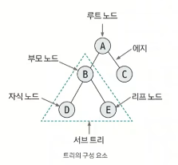

# 01. 트리

`정의`

노드와 엣지로 연결된 그래프의 특수한 형태

트리는 그래프의 종류 중 하나이기 때문에, 그래프의 표현으로도 tree를 표현할 수 있다.

 

`특징`

- 순환 구조를 지니고 있지 않고, 1개의 루트 노드가 존재한다.

- 루트 노드를 제외한 노드는 단 1개의 부모 노드를 갖는다.

- 트리의 부분 트리 역시 트리의 모든 특징을 따른다.

- 연결된 트리에서 **임의의 두 노드를 잇는 경로는 유일하다.**

 

### 트리의 핵심 이론

트리의 구성요소에 관해 간단하게 알아볼 필요가 있다.

| 구성 요소 | 설명                                |
| ----- | --------------------------------- |
| 노드    | 데이터의 index와 value를 표현하는 요소        |
| 엣지    | 노드와 노드의 연결 관계를 나타내는 선             |
| 루트 노드 | 트리에서 가장 상위에 존재하는 노드               |
| 부모 노드 | 두 노드 사이의 관계에서 상위 노드에 해당하는 노드      |
| 자식 노드 | 두 노드 사이의 관계에서 하위 노드에 해당하는 노드      |
| 리프 노드 | 트리에서 가장 하위에 존재하는 노드(자식 노드가 없는 노드) |
| 서브 트리 | 전체 트리에 속한 작은 트리                   |

 

### 코딩테스트에서의 트리 활용

크게 2가지로 활용 가능하다.

1. **그래프로 푸는 트리 문제**
- 인접 리스트로 표현 가능하다.
  
  - DFS, BFS를 활용하여 푸는 트리는 문제가 있다.

 

2. **트리만의 특징을 위한 문제**
- 이진 트리

- 세그먼트 트리(어려운 문제에서 자주 나옴)

- LCA(최소 공통 조상)

트리만의 특징을 가진 트리 문제는 그래프처럼 인접 리스트로 풀지 않는 경우가 많다.

-> 1차원 배열로 트리를 나타내는 경우가 있다.

| 0   | 1   | 2   | 3   | 4   | 5   | 6   | 7   |
| --- | --- | --- | --- | --- | --- | --- | --- |
|     | A   | B   | C   | D   | E   |     |     |

이렇게 1차원 배열을 만들었을 때 특정 노드의 부모 노드나 자식노드를 쉽게 찾을 수 있다.

이진 트리 기준으로 설명할 떄,

부모 노드를 찾는 방법은 자신의 인덱스/2를 하면 부모 노드가 나온다.

자식 노드를 찾는 방법은 인덱스\*2, 인덱스\*2+1하면된다.
