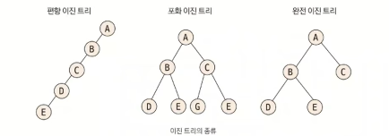
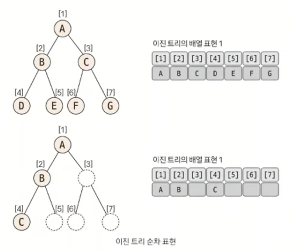

# 02. 이진 트리

`정의`

각 노드의 자식 노드의 개수가 2개 이하로 구성된 트리

 

### 핵심 이론

`이진 트리의 종류`

- 편향 이진 트리

- 포화 이진 트리
  
  - 리프 노드가 2개 쌍씩 모두 차있어야한다.

- 완전 이진 트리
  
  - 이진 트리인데, 마지막 뎁스에서 왼쪽부터 채워진 형태의 트리

일반적으로 우리가 사용하는 트리의 형태는 완전 이진트리를 활용한다. 

 

`이진 트리의 순차 표현`

가장 직관적이면서 편리한 트리 자료구조는 일차원 배열의 형태이다.

이진 트리의 배열 형태는 이미지처럼 표현을 해줄 수 있어야 한다.

 

**`배열의 인덱스 간 상관관계`**

| 이동 목표 노드  | 인덱스 연산            | 제약 조건(N = 노드 개수)   |
| --------- | ----------------- | ------------------ |
| 루트 노드     | index = 1         |                    |
| 부모 노드     | index = index / 2 | 현재 노드가 루트 노드가 아님   |
| 왼쪽 자식 노드  | index = index*2   | index * 2 <= N     |
| 오른쪽 자식 노드 | index = index*2+1 | index * 2 + 1 <= N |

일차원 배열로 나타낸 트리의 인덱스간 상관관계는 세그먼트 트리와 LCA에서 매우 중요한 지식이기 때문에 반드시 알아야 한다.
