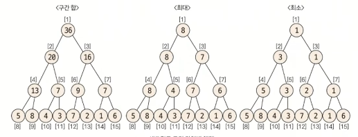
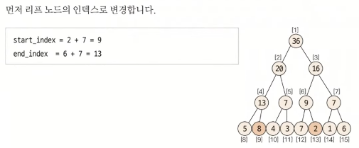

# 03. 세그먼트 트리(Segment Tree)

`정의`

주어진 데이터의 구간 합과 데이터 업데이트를 빠르게 수행하기 위해 고안해낸 자료구조의 형태

더 큰범위는 '인덱스 트리'라고 불린다.

`세그먼트 트리 등장 배경`

구간합은 일반적으로 불변하는 값들의 구간 합을 구하기 위함인데, 이러한 구간 합이 업데이트를 하게 될경우, 업데이트 속도가 느리기 때문에 등장했다.

 

### 핵심 원리

세그먼트 트리의 종류는 구간 합, 최대, 최대 구하기로 나눌 수 있다.

구현 단게는 트리 초기화, 정의값 구하기(구간 합 또는 최대, 최소), 데이터 업데이트 하기로 나눈다.

 

세그먼트 트리의 경우 우리가 가질 데이터는 리프 노드에 할당을 할 것이라고 생각해야 한다. 

 

1. **트리 초기화하기**

리프 노드의 개수가 데이터의 개수 이상이 되도록 트리 배열을 만든다.

-> 리프 노드에 실질적인 데이터들이 담길 것이기 때문이다.

트리 배열의 크기를 구하는 방법은 $2^k \geq N$를 만족하는 k의 최솟값을 구한 후 $2^k *2$를 트리 배열의 크기로 정의하면 된다.

다음과 같은 샘플 데이터가 있다면, $N=8$이기 때문에, $2^k \geq 8$ 을 만족하는 배열의 크기를 $2^k*2 = 16$으로 정의 한다.

샘플 데이터 $\rarr \{ 5, 8, 4, 3, 7, 2, 1, 6 \}$ 

다음과 같이 1차원 배열이 나온다.

k가 3이라면, startIndex는 $2^k$인 8이 된다.(리프 노드들의 부모노드들이 들어갈 부분)

트리 1장에서 말했던 것처럼 1차원 배열로 표현한 트리는 부모노드의 인덱스는 index/2이다.

부모 노드의 값을 자식노드 두개의 합 또는 최대 또는 최소로 데이터를 넣은 결과

1차원 배열을 트리로 나타낸 결과

 

2. **질의값 구하기**

주어진 질의의 인덱스를 세그먼트 트리의 리프 노드에 해당하는 인덱스로 변경한다.

원본 데이터는 그냥 $\{5, 8, 4, 3, 7, 2, 1, 6\}$의 형태로 주어졌는데, 원본 데이터를  트리로 바꾸면서 인덱스를 찾아야 한다.

 

`질의 인덱스를 세그먼트 트리 인덱스로 변경하는 방법`

세그먼트 트리의 인덱스는 다음과 같이 나타낼 수 있다.

$index = index + 2^k - 1$

 

`질의값 구하는 과정`

1. $startIndex\quad \% \quad2== 1 $ 일 때, 해당 노드를 선택 한다.

2. $endIndex\quad \% \quad2== 0$ 일 때, 해당 노드를 선택한다.

3. startIndex depth 변경: $startIndex = (startIndex + 1) / 2 $ 연산을 실행한다.

4. endIndex depth 변경: $endIndex = (endIndex -1)/2 $ 연산을 실행한다.

5. 1~4를 반복하다가 $endIndex \lt startIndex$가 되면 종료한다.

 

1번의 의미는 부모 노드 기준 오른쪽에 있는 자식노드이기 때문에, 해당 노드만 찝어준다는 뜻이다.

마찬가지로, 2번의 의미는 부모 노드 기준 왼쪽에 있는 자식 노드이기 때문에, 해당 노드만 찝어준다는 것이다.

따로 찝어준다는 의미는 해당 노드의 부모노드를 활용할 수 없기 때문에 따로 빼준다는 것이다.

 

해당 이유가 3번과 4번으로 나타난다. 3번과 4번에서 부모 노드를 찾는 연산을 실행하는데, startIndex+1을 하여 부모노드를 찾는 것은 startIndex % 2 == 0이 되고, 이는 자식노드가 부모노드 기준 왼쪽에 있어서 부모노드가 왼쪽과 오른쪽 노드의 질의값을 담고 있다는 뜻이다.

4번도 마찬가지 뜻이다. 3~4번을 반복하게 되면 이진 탐색처럼 $startIndex >endIndex$가 되는 상황이 나온다.

`질의에 해당하는 노드 선택 방법`

- 구간 합: 선택한 노드를 모두 더한다

- 최댓값 구하기: 선택된 노드 중 MAX값을 선택한다.

- 최솟값 구하기: 선택된 노드 중 MIN값을 선택하여 출력한다.

 

`예제`

해당 예제는 2~6번 인덱스의 값을 구하는 것으로 문제가 나왔다.

 

부모 노드로 이동 한다.

한번 더 부모 노드로 이동한다.

총 선택된 노드는 9번, 5번, 6번이고 해당 노드끼리 연산을 하면된다.

해당 예시는 구간합이기 때문에, 5, 6, 9번 노드를 더하면 우리가 질의한 구간합이 나온다.

 

3. **데이터 업데이트 하기**

기존의 데이터가 업데이트 되었을 때는 단지 부모 노드를 올라가면서 변경된 값을 적용하기만 하면 된다.

 

### 요약 정리

세그먼트 트리 단계

1. 트리 초기화 하기 = 크기 정하기

$2^k \geq N$을 만족하는 k의 최솟값을 찾아서 배열의 크기를 $2^k*2$만큼의 크기로 배열을 초기화 한다.

2. 부모 노드 초기화 하기

$2^k$를 startIndex로하여 데이터를 순차적으로 채워 넣는다.

3. 질의값 구하기
   
   - 질의 index를 트리에 맞게 변경 index = index + $2^k -1$
   
   - startIndex % 2 == 1 $\rarr$ 노드 선택
   
   - endIndex % 2 == 0 $\rarr$ 노드 선택
   
   - $startIndex =(startIndex + 1)/2$
   
   - $endIndex=(endIndex+1)/2$ 
   
   - $startIndex > endIndex$일 떄까지 반복

 

세그먼트 트리를 사용하는 이유 구간합이나 특정 구간 사이에서 데이터를 구하는데, 데이터가 부분적으로 지속적으로 변경되는 경우에 일반적인 구간합이 아닌 세그먼트 트리를 사용한다.

 

추천 문제: [구간 합 구하기](https://www.acmicpc.net/problem/2042)
